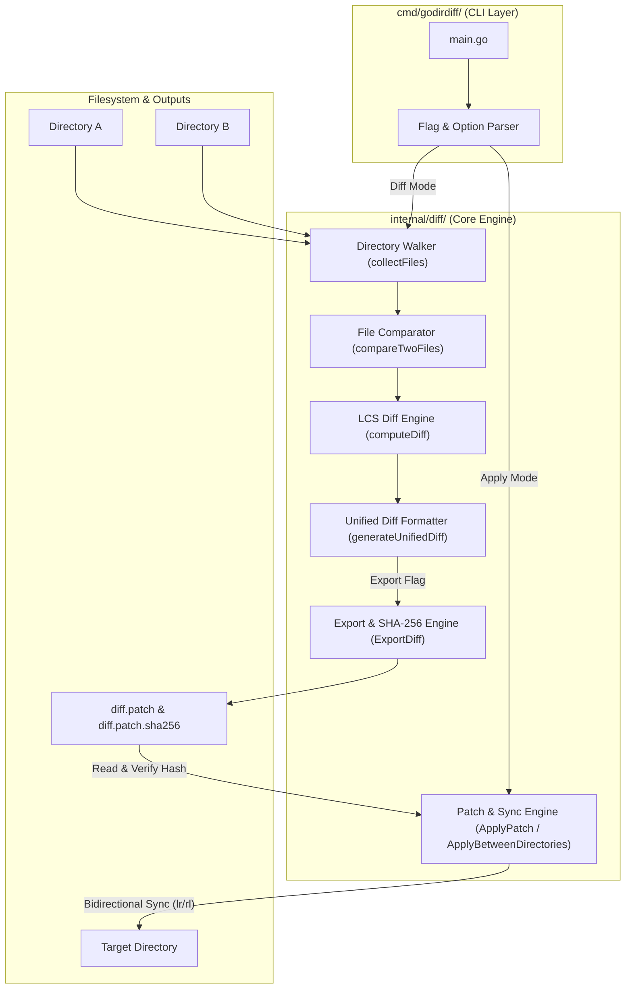
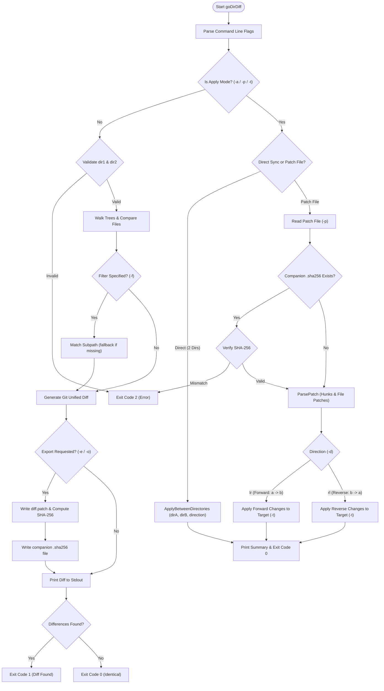

# goDirectoryDiff

`goDirectoryDiff` is a high-performance command-line tool written in Go that recursively compares two directories and outputs changes in standard Git unified diff format, exports diffs with companion cryptographic checksums, and provides bidirectional patch application.

The project executable CLI binary is **`goDirDiff`**.

---

## Purpose & Feature Matrix

| Feature | CLI Flags | Purpose & Description |
|---|---|---|
| **Pure Go Architecture** | N/A | Written purely using the Go 1.26 standard library with zero third-party dependencies for maximum portability and security. |
| **Git Unified Diff Format** | `<dir1> <dir2>` | Emits standard Git patch format (`diff --git a/... b/...`, `--- a/...`, `+++ b/...`, `@@ -x,y +x,y @@`) compatible with `git apply` and standard patch utilities. |
| **File Lifecycle Detection** | Automatic | Distinguishes between modified files, newly added files (`new file mode 100644`), and deleted files (`deleted file mode 100644`). |
| **Binary File Detection** | Automatic | Inspects file byte streams for null bytes and outputs binary diff notices (`Binary files a/... and b/... differ`) to prevent terminal corruption. |
| **Path Filtering** | `-f`, `--filter` | Scopes directory comparison to a specific file or subfolder. If the path does not exist, it gracefully falls back to a full comparison. |
| **Configurable Context** | `-c`, `--context` | Customizes the number of context lines surrounding each diff hunk (defaults to 3 lines). |
| **Diff Export Mechanism** | `-e`, `--export`, `-o`, `--export-path` | Exports the unified diff to a destination file or folder (defaults to `exported_diff/diff.patch`). Creates parent folders automatically. |
| **SHA-256 Checksums** | Companion `.sha256` | Automatically computes SHA-256 hashes and generates companion `.sha256` files in standard GNU `sha256sum` format for cryptographic integrity verification. |
| **Bidirectional Patching** | `-a`, `--apply`, `-d`, `--direction` | Built-in patch engine supporting forward (`lr`, `l->r`) and reverse (`rl`, `r->l`) patch application from exported diff files. |
| **Direct Tree Sync** | `-a <dir1> <dir2>` | Directly synchronizes differences between two directory trees in either direction without requiring an intermediate patch file. |
| **ANSI Color Output** | `--color` | Colorizes diff output in supported terminals (red for deletions, green for additions, cyan for headers). |
| **Sample Demonstrations** | `examples/` | Includes pre-packaged example directories (`examples/dir_v1` and `examples/dir_v2`) and pre-generated sample folder diff files (`sample_folder_diff.diff`, `sample_folder_diff.patch`, `sample_folder_diff.txt`) showing Git-diff style output. |

---

## Architecture Diagram

The system is organized into modular components adhering to standard Go project conventions:



---

## Workflow Diagram

The flowchart below demonstrates the decision logic and execution paths in `goDirDiff`:



---

## Project Structure

```text
goDirectoryDiff/
├── cmd/
│   └── godirdiff/
│       └── main.go           # CLI entry point, executable name: goDirDiff
├── internal/
│   └── diff/
│       ├── diff.go           # Core engine: traversal, LCS diff, export, patch
│       └── diff_test.go      # Comprehensive unit tests (87.1% coverage)
├── examples/
│   ├── dir_v1/                   # Baseline sample directory
│   ├── dir_v2/                   # Modified sample directory (additions/deletions/changes)
│   ├── sample_folder_diff.diff   # Pre-generated sample Git unified diff
│   ├── sample_folder_diff.patch  # Git unified patch format
│   └── sample_folder_diff.txt    # Demonstration text file showing folder diff format
├── exported_diff/                # Default directory for exported patches & checksums
├── go.mod                    # Module definition (Go 1.26)
├── README.md                 # Project documentation & architecture
└── USAGE.md                  # Comprehensive command line user guide
```

---

## Building

```bash
go build -o goDirDiff ./cmd/godirdiff
```

---

## Testing & Verification

```bash
# Run unit tests with code coverage
go test -v -cover ./...

# Run static analysis
go vet ./...

# Format codebase
go fmt ./...
```
