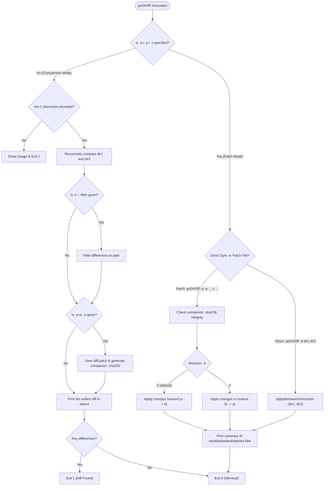

# USAGE: goDirDiff

`goDirDiff` is a versatile directory comparison, diff export, and bidirectional patch application tool.

---

## Command Syntax Overview

```bash
# 1. Compare two directories
goDirDiff [options] <dir1> <dir2>

# 2. Apply a patch file to a target directory
goDirDiff -a [-d lr|rl] -p <patch_file> -t <target_dir>

# 3. Synchronize two directories directly
goDirDiff -a [-d lr|rl] <dir1> <dir2>
```

---

## Options & Flags Reference

| Flag | Shorthand | Description | Default |
|---|---|---|---|
| `-apply` | `-a` | Enable patch application / synchronization mode | `false` |
| `-patch <file>` | `-p <file>` | Path to patch file to apply | `exported_diff/diff.patch` |
| `-target <dir>` | `-t <dir>` | Target directory to apply patch to | `""` |
| `-direction <mode>` | `-d <mode>` | Patch direction: `lr` (`l->r`, forward) or `rl` (`r->l`, reverse) | `lr` |
| `-export` | `-e` | Export diff to default directory (`exported_diff/`) | `false` |
| `-export-path <path>`| `-o <path>` | Custom destination file or directory path for export | `""` |
| `-filter <path>` | `-f <path>` | Scope diff to a specific file or subfolder | `""` |
| `-context <n>` | `-c <n>` | Number of context lines surrounding diff hunks | `3` |
| `-color` | N/A | Enable ANSI colored terminal diff output | `false` |
| `-help` | `-h` | Display command help and usage instructions | |

---

## Exit Codes

| Code | Status | Meaning |
|---|---|---|
| `0` | Success / Clean | In comparison mode: directories are identical. In patch mode: patch applied successfully. |
| `1` | Differences Found | In comparison mode: differences were found and output to stdout. |
| `2` | Error | Execution failed (e.g. invalid arguments, missing directories, checksum mismatch). |

---

## CLI Decision Flowchart



---

## Feature Guides & Practical Examples

### 1. Basic Directory Comparison
Compare two folders and display standard Git unified diffs on stdout:

```bash
./goDirDiff examples/dir_v1 examples/dir_v2
```
*Output snippet:*
```diff
diff --git a/README.txt b/README.txt
--- a/README.txt
+++ b/README.txt
@@ -1,7 +1,8 @@
 Project Alpha
-Version 1.0.0
+Version 2.0.0
 Author: Team Alpha
...
```

---

### 2. Colorized Terminal Output
Highlight additions in green and deletions in red for enhanced terminal readability:

```bash
./goDirDiff --color examples/dir_v1 examples/dir_v2
```

---

### 3. Custom Context Lines
Adjust the amount of surrounding context lines displayed around changed hunks:

```bash
# 5 lines of context
./goDirDiff -c 5 examples/dir_v1 examples/dir_v2

# 1 line of context (compact view)
./goDirDiff -c 1 examples/dir_v1 examples/dir_v2
```

---

### 4. Scoped Filtering (`-f` / `--filter`)
Focus only on changes within a specific file or subfolder:

```bash
# Compare only config.json
./goDirDiff -f config.json examples/dir_v1 examples/dir_v2

# Compare only a subfolder
./goDirDiff -f services/api examples/dir_v1 examples/dir_v2
```
*Note: If the filtered path does not exist in the comparison, `goDirDiff` gracefully falls back to showing all changes.*

---

### 5. Exporting Diffs & Generating SHA-256 Checksums

#### Export to Default Location (`exported_diff/`)
```bash
./goDirDiff -e examples/dir_v1 examples/dir_v2
```
Generates:
- `exported_diff/diff.patch`: Git-compatible unified diff file.
- `exported_diff/diff.patch.sha256`: Companion cryptographic checksum file in standard GNU format.

#### Export to a Custom File or Directory
```bash
# Export to a custom patch file
./goDirDiff -o builds/release_v2.patch examples/dir_v1 examples/dir_v2

# Export to a specific directory (writes diff.patch and diff.patch.sha256 inside)
./goDirDiff -o /tmp/patches/ examples/dir_v1 examples/dir_v2
```

#### Verifying Checksums
The companion checksum file can be verified using standard system utilities:
```bash
cd exported_diff
sha256sum -c diff.patch.sha256
# Output: diff.patch: OK
```

---

### 6. Bidirectional Patch Application

#### Forward Application (`l->r`)
Applies changes from `dir1` to `dir2` onto a target directory:

```bash
# Apply diff.patch to /path/to/target (defaults to direction: lr)
./goDirDiff -a -p exported_diff/diff.patch -t /path/to/target

# Explicit forward syntax
./goDirDiff -a -d lr -p exported_diff/diff.patch -t /path/to/target
```
*Features automatic validation: If `diff.patch.sha256` is present alongside `diff.patch`, `goDirDiff` verifies integrity before modifying any target files.*

#### Reverse Application (`r->l`)
Reverses changes from `dir2` back to `dir1` (restores deleted files, reverts modified lines, and deletes files added in v2):

```bash
./goDirDiff -a -d rl -p exported_diff/diff.patch -t /path/to/target
```

---

### 7. Direct Directory Synchronization
Directly synchronize differences between two directory trees without creating an intermediate patch file:

```bash
# Update dir_a to match dir_b in-place (forward: lr)
./goDirDiff -a examples/dir_v1 examples/dir_v2

# Update dir_b to match dir_a in-place (reverse: rl)
./goDirDiff -a -d rl examples/dir_v1 examples/dir_v2
```

---

### 8. Testing with Sample Directories
The project includes sample directories (`examples/dir_v1` and `examples/dir_v2`) designed for end-to-end testing:

```bash
# 1. Compare sample directories
./goDirDiff examples/dir_v1 examples/dir_v2

# 2. Export patch
./goDirDiff -e examples/dir_v1 examples/dir_v2

# 3. Test patch in temporary folder
TEMP_DIR=$(mktemp -d)
cp -r examples/dir_v1/* "$TEMP_DIR"
./goDirDiff -a -p exported_diff/diff.patch -t "$TEMP_DIR"
./goDirDiff "$TEMP_DIR" examples/dir_v2 # returns 0 (identical)
rm -rf "$TEMP_DIR"
```
